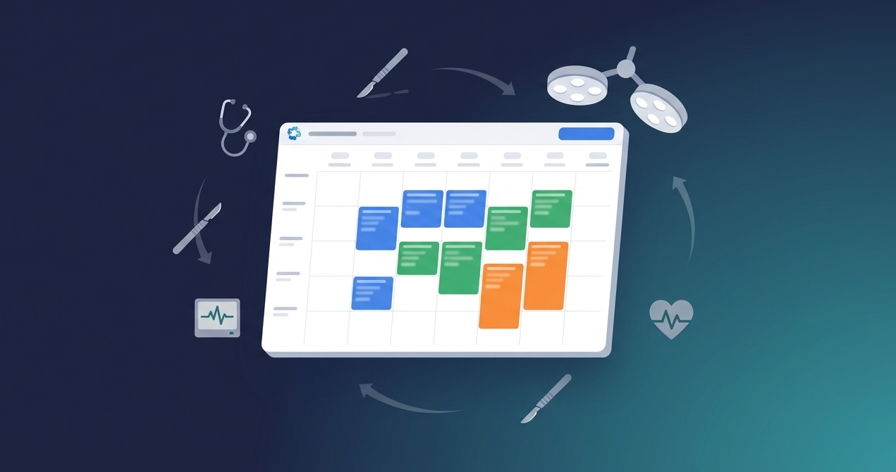
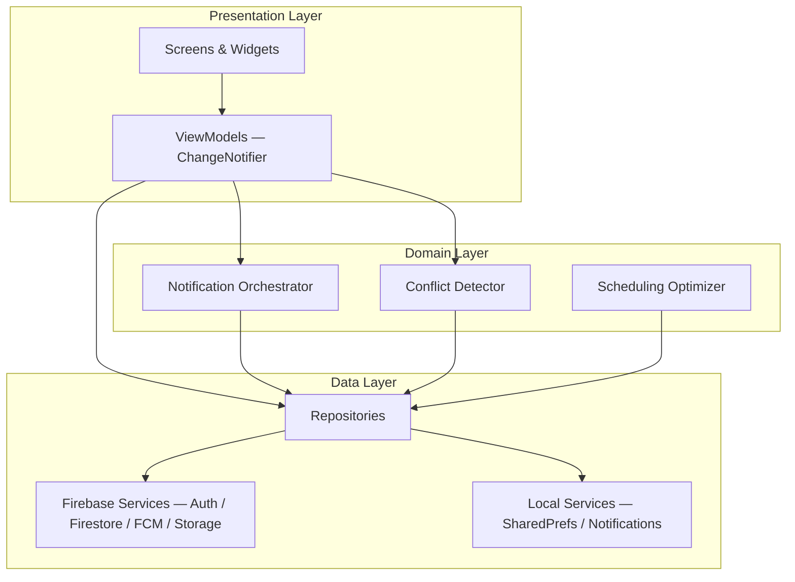

<p align="center">
  
</p>

<h1 align="center">OR Scheduler</h1>
<p align="center"><strong>Operating Room Management System</strong></p>

<p align="center">
  
  
  
  
  
</p>

---

## About

Healthcare facilities struggle with manual OR scheduling — leading to underutilized rooms, communication gaps between surgical teams, and scheduling conflicts. **OR Scheduler** is a cross-platform Flutter application backed by Firebase that provides real-time scheduling, automated conflict detection, and instant notifications for operating room coordination.

Built as a capstone engineering project at **Carleton University** (SYSC 4907, 2024–2025).

## Features

- **Schedule Management** — Day, week, month, and TV display views with drag-and-drop
- **Multi-Role Authentication** — Doctor, Nurse, Technologist, and Admin roles with scoped permissions
- **Real-Time Notifications** — Push (FCM), SMS (Twilio), and email (SendGrid)
- **Resource Conflict Detection** — Automatic checks for room, staff, and equipment overlaps
- **Staff Directory** — Searchable directory with filters by role and department
- **Equipment Catalog** — Track availability and assignment of surgical equipment
- **Patient Lookup** — Quick search across patient records
- **Surgery Log & Audit Trail** — Full history of surgical operations and changes
- **Dark Mode & Accessibility** — System-aware theming with accessible design
- **CSV Bulk Import** — Import schedules and staff data from spreadsheets

## Architecture



## Tech Stack

| Category | Technology |
|----------|-----------|
| Frontend | Flutter 3.5+, Dart 3.5+ |
| Backend | Firebase (Auth, Firestore, Storage, FCM) |
| State Management | Provider (ChangeNotifier + MVVM) |
| Notifications | FCM, flutter_local_notifications, Twilio SMS |
| Calendar | Syncfusion Flutter Calendar, Table Calendar |

## Getting Started

### Prerequisites

- [Flutter SDK](https://flutter.dev/docs/get-started/install) 3.5+
- [Node.js](https://nodejs.org) 18+ (for Firebase emulators)
- [Firebase CLI](https://firebase.google.com/docs/cli) 13+
- Java 11+ (for emulators)

### Quick Start

```bash
git clone https://github.com/harishan-a/schedule-OR.git
cd schedule-OR
make setup    # Install dependencies and verify tools
make dev      # Start emulators, seed data, and launch app
```

The app opens at **http://localhost:3000**. See [DEVELOPMENT.md](DEVELOPMENT.md) for the full local setup guide, test credentials, and all available `make` commands.

## Project Structure

```
lib/
├── config/              # Firebase options
├── core/                # Constants, base theme
├── features/            # Feature modules (feature-first architecture)
│   ├── auth/            #   Authentication screens
│   ├── doctor/          #   Staff directory & details
│   ├── home/            #   Dashboard, stats, announcements
│   ├── profile/         #   User profile management
│   ├── schedule/        #   Calendar views, resource checks
│   ├── settings/        #   App settings & preferences
│   └── surgery/         #   Surgery CRUD, log, audit trail
├── repositories/        # Data access layer
├── services/            # Firebase, notification, Twilio services
├── viewmodels/          # ChangeNotifier ViewModels (MVVM)
└── shared/              # Models, theme, widgets, utilities
```

## Firebase Security Note

The API keys in `lib/config/firebase_options.dart` and `web/firebase-messaging-sw.js` are **client-side identifiers**, not secrets. This is standard Firebase practice — security is enforced by [Firestore Security Rules](https://firebase.google.com/docs/firestore/security/get-started) and Firebase Authentication, not by hiding these keys. See [SECURITY.md](SECURITY.md) for details.

## Team

**Group #20** — Carleton University SYSC 4907 (2024–2025)

| Name | Role |
|------|------|
| Nikita Sara Vijay | Developer |
| Faiaz Ahsan | Developer |
| Keya Patel | Developer |
| Evan Baldwin | Developer |
| Harishan Amutheesan | Developer |

**Supervisor:** Professor Lynn Marshall

## License

This project is licensed under the MIT License — see [LICENSE](LICENSE) for details.

## Contributing

Contributions are welcome! Please read [CONTRIBUTING.md](CONTRIBUTING.md) before submitting a pull request.
